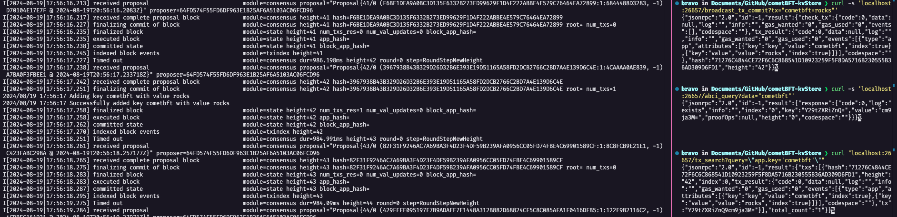

# CometBFT kvStorage

A hands-on exploration of CometBFT, a Byzantine Fault Tolerant consensus engine for state-machine replication.
This project follows the CometBFT tutorial, running the CometBFT service directly within the same process as the application.

